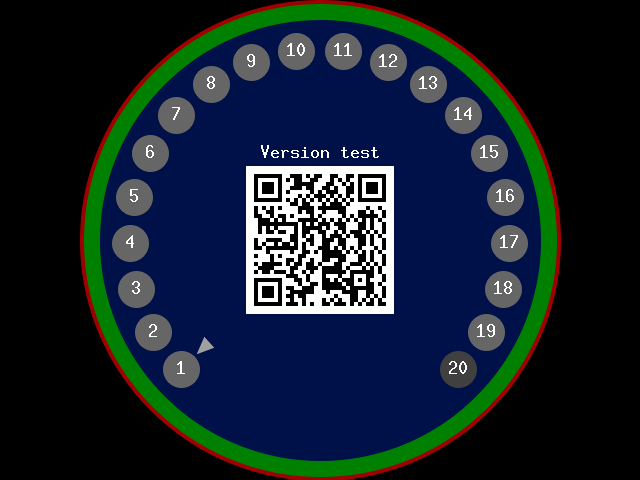

Rokid Factory Test Mode(RFTM)
=============================

build status
-------------

|               Linux & Mac OS               |                     Windows                    |
|--------------------------------------------|------------------------------------------------|
| [![Build Status][travis-badge]][travis-ci] | [![Build status][appveyor-badge]][appveyor-ci] |

[travis-ci]:https://travis-ci.org/ftmdevlopment/rftm
[travis-badge]: https://travis-ci.org/ftmdevlopment/rftm.svg?branch=master
[appveyor-ci]: https://ci.appveyor.com/project/xusiwei/rftm
[appveyor-badge]: https://ci.appveyor.com/api/projects/status/4qb35hl2f8fpi1wt?svg=true

quick start
------------

1. ndk-build enviroment setup
  1. [download NDK toolchain package](https://developer.android.com/ndk/downloads/index.html)(I used `r13b`).
  2. uncompress NDK package.
  3. add the uncompressed directory to `PATH`.
2. download source code here
  1. `git clone https://github.com/ftmdevlopment/rftm.git`.
  2. `cd rftm && git submodule update --init --recursive`.
3. ndk-build and run

Screenshot
-----------

Main UI:

